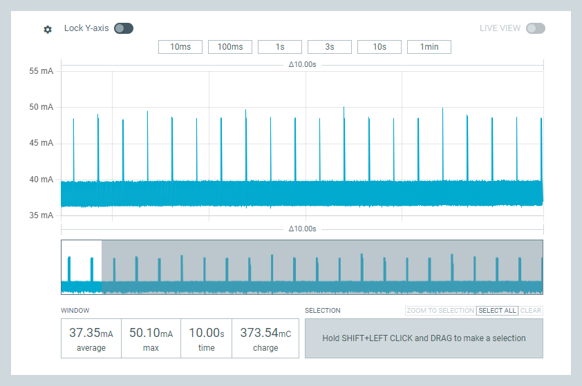
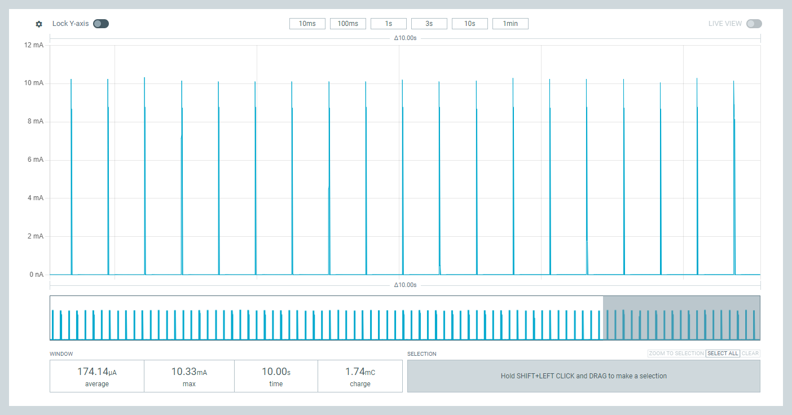
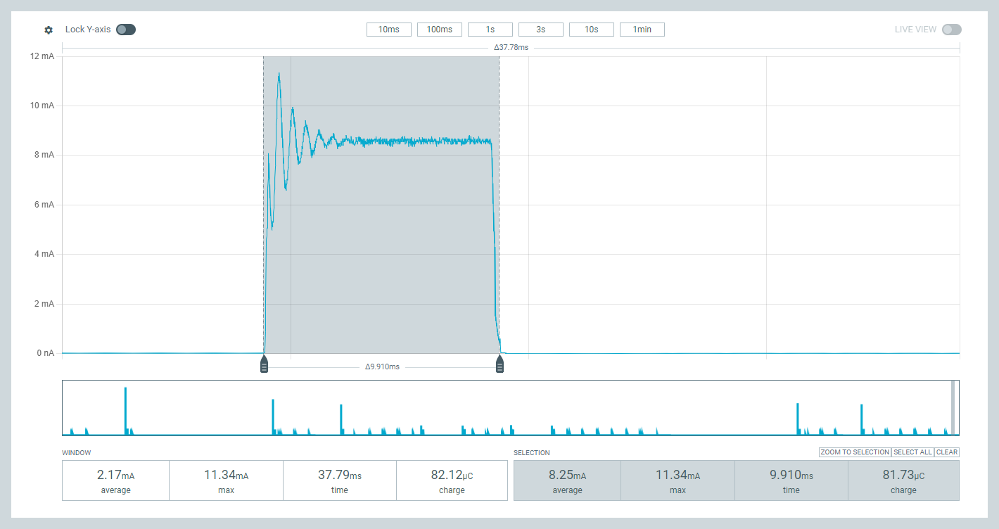
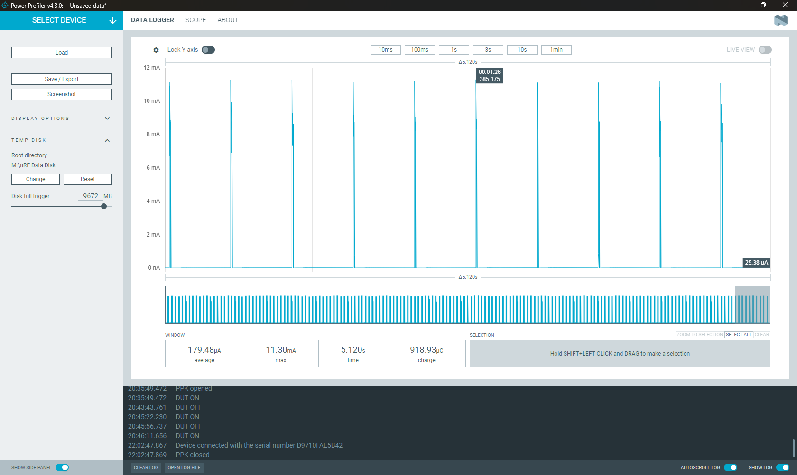

# **NPPPK2 Power Measurement Images**

This document contains analysis of power consumption measurements captured using what appears to be a Nordic Power Profiler Kit (NPPPK2) or similar current measurement tool.

## **Image 1: Sketch initialzation**

* **Current Range**: 35-55 mA  
* **Pattern**: Regular periodic spikes reaching ~50 mA  
* **Baseline**: ~37-40 mA  
* **Measurements**:  
  * Average: 37.35 mA  
  * Max: 50.10 mA  
  * Time: 10.00s  
  * Charge: 373.54 mC  
* **Analysis**: Shows periodic high-current activity, likely radio transmission or processing events

## **Image 2: Task 1: radio.sleep function called**

* **Current Range**: 0-12 mA  
* **Pattern**: Regular spikes reaching ~11 mA  
* **Baseline**: Near 25.38 µA between spikes  
* **Measurements**:  
  * Average: 179.48 µA  
  * Max: 11.30 mA  
  * Time: 5.120s  
  * Charge: 918.93 µC  
* **Analysis**: Lower power mode with periodic wake-up events, typical of sensor sampling or beacon transmission

## **Image 3: Task 2:  Timer expired; Deep sleep**

* **Current Range**: 0-12 mA  
* **Pattern**: Very regular, clean spikes  
* **Baseline**: ~0 mA  
* **Measurements**:  
  * Average: 174.14 µA  
  * Max: 10.33 mA  
  * Time: 10.00s  
  * Charge: 1.74 mC  
* **Analysis**: Optimized low-power operation with consistent periodic activity

## **Image 4: Deep Sleep:  Spike duration**

* **Current Range**: 0-12 mA  
* **Pattern**: Extended active period (~910ms) with initial spike and sustained current  
* **Baseline**: 0 mA when inactive  
* **Measurements**:  
  * Window Average: 2.17 mA, Max: 11.34 mA  
  * Selection Average: 8.25 mA, Max: 11.34 mA  
  * Active Duration: 9.910ms  
  * Charge: 81.73 µC  
* **Analysis**: Shows a longer processing or communication event with initial peak and sustained activity

## **Image 5: Deep Sleep:  Between Spikes**

* **Current Range**: 19.5-22 µA  
* **Pattern**: Continuous current draw with significant noise/variation  
* **Baseline**: ~20-21 µA  
* **Measurements**:  
  * Average: 20.59 µA  
  * Max: 21.58 µA  
  * Time: 10.00s  
  * Charge: 205.86 µC  
* **Analysis**: Steady-state current consumption, possibly idle mode with active peripherals

## **Summary**

These measurements show different operational modes of what appears to be a low-power embedded device:

1. **High Activity Mode**: 37-50 mA range with regular transmission/processing  
2. **Sensor/Beacon Mode**: Periodic ~11 mA spikes with µA-level average  
3. **Optimized Sleep Mode**: Clean periodic wake-ups with minimal power  
4. **Processing Events**: Extended active periods for data processing/transmission  
5. **Idle State**: Continuous low µA consumption

The measurements demonstrate good power management with clear distinctions between active and sleep states, which is typical for battery-powered IoT or wireless sensor devices.
