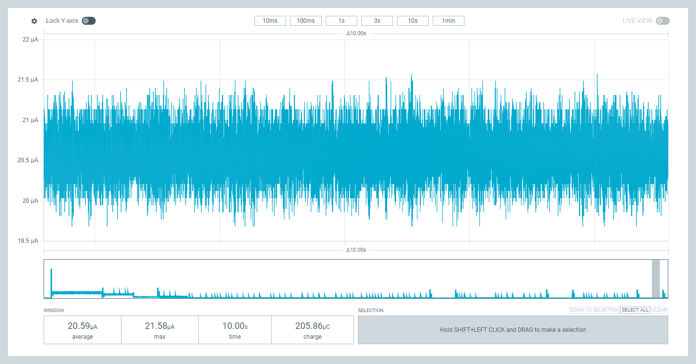

# **NPPK II Power Measurement Images**

These images show how much battery power the EoRa PI board uses in different operating modes.  This document contains analysis of power consumption measurements 
captured using a Nordic Power Profiler Kit II, measurement tool.  [Nordic Power Profiler Kit II](https://www.digikey.com/en/products/detail/nordic-semiconductor-asa/NRF-PPK2/13557476)

## **Image 1:  Initalization**

* **Current Range**: 35-55 mA  
* **Pattern**: Regular periodic spikes reaching ~50 mA  
* **Baseline**: ~37-40 mA  
* **Measurements**:  
  * Average: 37.35 mA  
  * Max: 50.10 mA  
  * Time: 10.00s  
  * Charge: 373.54 mC  
* **Analysis**: Shows periodic high-current activity, "EoRa PI" development board initalization.

## **Image 2: Task 1:  Turn on load; LoRa radio sleep**

* **Current Range**: 19.5-22 µA  
* **Pattern**: Radio Sleep  active; continuous current draw with significant noise/variation  
* **Baseline**: ~20-21 µA  
* **Measurements**:  
  * Average: 20.59 µA  
  * Max: 21.58 µA  
  * Time: 10.00s  
  * Charge: 205.86 µC  
* **Analysis**: Steady-state current consumption in deep sleep mode, Radio sleep ends in 120 seconds

## **Image 3: Task 2:  Turn off load; Deep sleep**

* **Current Range**: 0-12 mA  
* **Pattern**: Very regular, clean spikes  
* **Baseline**: 25.38 µA  
* **Measurements**:  
  * Average: 174.14 µA  
  * Max: 10.33 mA  
  * Time: 10.00s  
  * Charge: 1.74 mC  
* **Analysis**: Optimized low-power operation with Lora radio, duty cycle "spikes" (listening)

## **Image 4: Deep Sleep: Spike duration**

* **Current Range**: 0-12 mA  
* **Pattern**: Extended active period (~910ms) with initial spike and sustained current  
* **Baseline**: 25.38 µA when inactive  
* **Measurements**:  
  * Window Average: 2.17 mA, Max: 11.34 mA  
  * Selection Average: 8.25 mA, Max: 11.34 mA  
  * Active Duration: 9.910ms  
  * Charge: 81.73 µC  
* **Analysis**: Shows a longer processing or communication event with initial peak and sustained activity

## **Image 5: Deep sleep:  Between Spikes**

* **Current Range**: 0-12 mA  
* **Pattern**: Regular spikes reaching ~11 mA  
* **Baseline**: 25.38 µA between spikes  
* **Measurements**:  
  * Average: 179.48 µA  
  * Max: 11.30 mA  
  * Time: 5.120s  
  * Charge: 918.93 µC  
* **Analysis**: Lower power mode with periodic wake-up events, typical of sensor sampling or beacon transmission

## **Summary**

These measurements show different operational modes of Ebyte's:  "EoRa PI" Development Board, [EoRa-S3-900TB]([url](https://ebyteiot.com/products/ebyte-oem-odm-eora-s3-900tb-22dbm-7km-mini-low-power-and-long-distance-sx1262-rf-module-lora-module-915mhz?_pos=2&_sid=f499d7703&_ss=r))

1. **High Activity Mode**: 37-50 mA range with regular transmission/processing  
2. **Deep Sleep Mode**: Continuous ~175 µA consumption in Duty Cycle listening mode
3. **Radio Sleep Mode** 25.38 µA between, load turn on and load turn off; no LoRa radio listening during this interval
4. **Optimized Sleep Mode**: Clean periodic wake-ups with minimal power  
5. **Processing Events**: Extended active periods for data processing/transmission  
6. **Duty Cycle Mode**: Periodic ~11 mA spikes with µA-level average

The measurements demonstrate good power management with clear distinctions between active and sleep states
